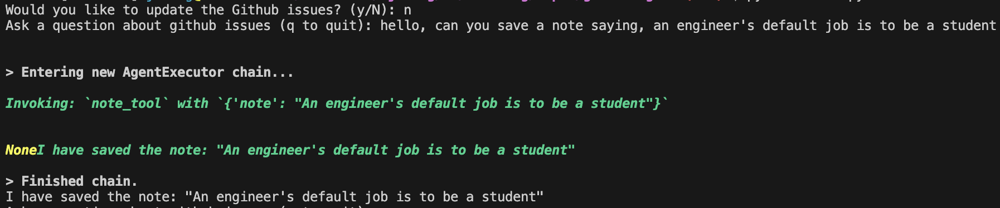

## Project Summary
This project is to build our own custom AI agent within Python using Retrieval Augmented Generation (RAG) and LangChain. This AI agent also acts as a coding or Github assistant, saving notes from a prompt.
___

#### Tools used
- OpenAI: https://platform.openai.com/api-keys
- AstraDB: https://www.ibm.com/products/datastax
- LangChain: https://docs.langchain.com/oss/python/langchain/overview
- LangChain Model: hwchase17/openai-functions-agent
___
#### Steps of starting the project
##### Start off by creating a virtual environment
```
python3 -m venv venv
```
##### Install dependency modules
```
python3 -m pip install -r requirements.txt
```
### Project structure overview
```bash
github-ai-agent
├── github.py
├── LICENSE
├── main.py
├── note.py
├── notes.txt
├── README.md
└── requirements.txt
```

`main.py`: This is the entry point of our application. It defines the remote Astra vector DB connection and start prompting the user for questions.

`github.py`: This is serving as a module - it connects to the github repo configured in .env file. This module is currently only searching the Github repo issues, but it can extend more if needed

`note.py`: This function is to asking the custom AI agent to write down the prompt as note and append the note into **notes.txt** file

___
## FAQ:
##### Run into SSL issue locally
References:
- https://stackoverflow.com/questions/77442172/ssl-certificate-verify-failed-certificate-verify-failed-unable-to-get-local-is

Options:
1. python3 -m pip install pip-system-certs
2. python3 -m pip install certifi

##### Why do we delete the DB collection if we want to update the Github issues?
Imagine the github issues may have been resolved or cleared before we run this program or cronjob does, so start from a fresh pull/fetch

##### Import LangChain module not working
Old
`from langchain.tools.retriever import create_retriever_tool`

New:
`from langchain_core.tools.retriever import create_retriever_tool`

Reference:
- https://reference.langchain.com/v0.3/python/core/tools/langchain_core.tools.retriever.create_retriever_tool.html

